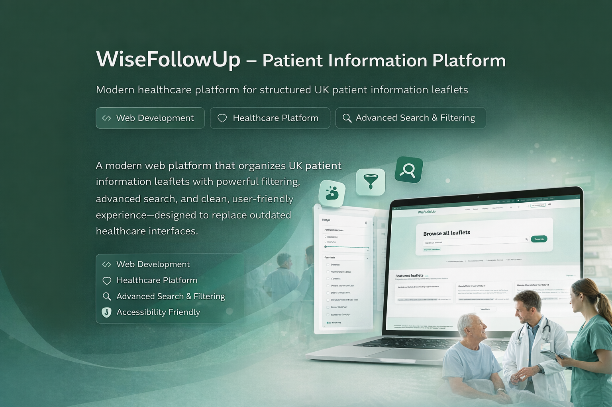

# WiseFollowUp – Patient Information Platform

🔗 **Live Website:**  
👉 https://wisefollowup.com/

---

## 🚀 Project Overview

WiseFollowUp is a modern healthcare web platform designed to organize and present **UK patient information leaflets** in a clear, structured, and user-friendly way.

The platform replaces outdated healthcare interfaces with a clean, modern UI and powerful discovery tools, enabling patients and healthcare users to quickly find accurate, trusted medical information.

---

## ✨ Key Features

### 🔹 Advanced Filtering System
Users can filter patient information leaflets by:
- Publication year  
- Country  
- County  
- Body system  
- Organization type  
- Organization name  

This enables fast access to highly specific and relevant medical content.

---

### 🔹 Advanced Search
- Search by **Trust ID**
- Search by **Author**
- Optimized for speed and accuracy across large datasets

---

### 🔹 Search History
- Saves recent searches automatically
- Improves navigation flow
- Enhances overall user experience for repeat users

---

### 🔹 Modern & Accessible UI
- Clean, healthcare-focused design
- Optimized for readability and clarity
- Accessibility-friendly experience suitable for patients and elderly users

---

## 🛠 Tech Stack

- **React.js**
- **Tailwind CSS**
- **Modern JavaScript (ES6+)**
- **Vite**
- **Component-based architecture**

---

## 🧠 Development Approach

- Scalable and maintainable frontend architecture
- Clear separation of concerns
- Performance-focused rendering
- UX-driven development for real healthcare use cases

---

## 🎯 Project Goals

- Improve access to trusted patient medical information
- Replace outdated medical website interfaces
- Enable fast and accurate content discovery
- Deliver a smooth, accessible healthcare web experience

---

## 👨‍💻 Author

**Maged Elshafey**  
Web Developer specialized in building modern, accessible healthcare web platforms with advanced search and data organization.

---

## 📄 License

This project is showcased for portfolio purposes.
